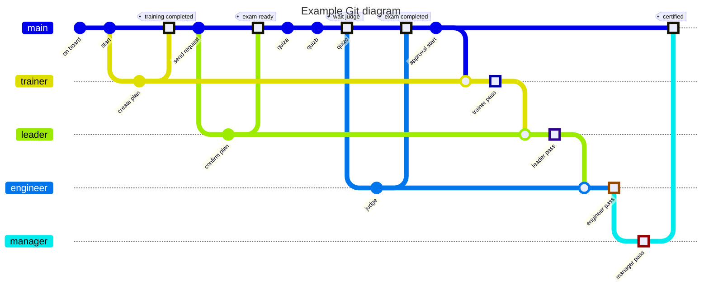

```mermaid
---
title: Example Git diagram
---
gitGraph
   commit id: "on board"
   commit id: "start"
   branch trainer
   checkout trainer
   commit id: "create plan"
   checkout main
   merge trainer tag: "training completed" type: HIGHLIGHT
   commit id: "send request"
   branch leader
   checkout leader
   commit id: "confirm plan"
   checkout main
   merge leader tag: "exam ready" type: HIGHLIGHT
   commit id: "quiza"
   commit id: "quizb"
   commit id: "quizc" tag: "wait judge" type: HIGHLIGHT
   branch engineer
   checkout engineer
   commit id: "judge"
   checkout main
   merge engineer tag: "exam completed" type: HIGHLIGHT
   commit id: "approval start"
   checkout trainer
   merge main
   commit id: "trainer pass" type: HIGHLIGHT
   checkout leader
   merge trainer
   commit id: "leader pass" type: HIGHLIGHT
   checkout engineer
   merge leader
   commit id: "engineer pass" type: HIGHLIGHT
   branch manager
   checkout manager
   commit id: "manager pass" type: HIGHLIGHT
   checkout main
   merge manager tag: "certified" type: HIGHLIGHT
```

```
mindmap
Root
    A
      B
      C
```
